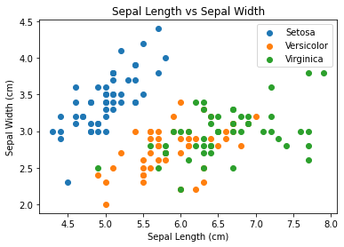
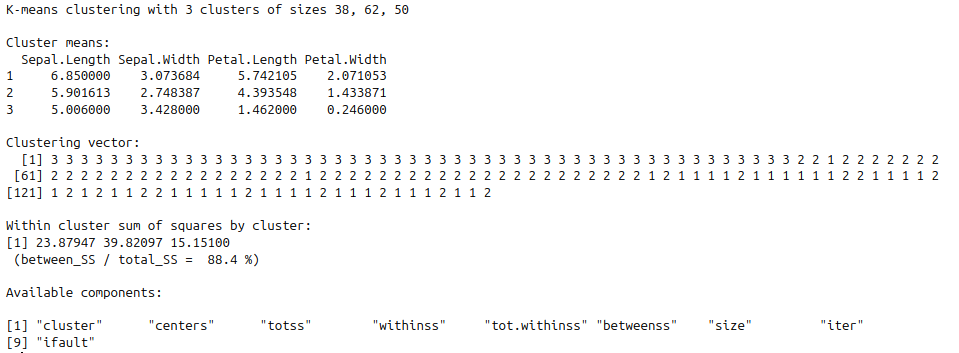
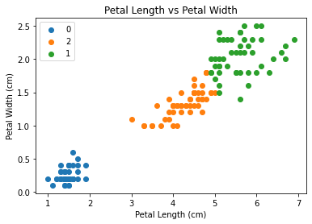

# Clustering

Clustering involves the categorisation of data points based on their similarities, offering a robust method for detecting patterns within datasets. It typically operates without the need for training, distinguishing it as an unsupervised learning approach. This lack of training requirement facilitates swift application..

## Applications of Clustering
* Looking for trends in data
* Data compression, all data clustering around a point can be reduced to just that point. For example, reducing colour depth of an image.
* Pattern recognition

## K-means Clustering

he K-means clustering algorithm is a straightforward technique aimed at pinpointing the centroid of each cluster. It achieves this by seeking a point that minimizes the distance between the centroid and all the points within the cluster. While the algorithm requires a predetermined number of clusters to identify, a common approach involves experimenting with various cluster numbers and employing additional tests to determine the optimal configuration.

### Limitations of K-Means

* Requires number of clusters to be known in advance
* Struggles when clusters have irregular shapes
* Will always produce an answer finding the required number of clusters even if the data isn't clustered (or clustered in that many clusters).
* Requires linear cluster boundaries

### Advantages of K-Means

* Simple algorithm, fast to compute. A good choice as the first thing to try when attempting to cluster data.
* Suitable for large datasets due to its low memory and computing requirements.

### Lets look at our data
So firstly lets have a look at the features within our dataset: 

~~~
data("iris")
head(iris)
~~~
{: .language-r}

><pre style="color: black; background: white;">
>  Sepal.Length Sepal.Width Petal.Length Petal.Width Species
>1          5.1         3.5          1.4         0.2  setosa
>2          4.9         3.0          1.4         0.2  setosa
>3          4.7         3.2          1.3         0.2  setosa
>4          4.6         3.1          1.5         0.2  setosa
>5          5.0         3.6          1.4         0.2  setosa
>6          5.4         3.9          1.7         0.4  setosa
></pre>
{: .output}

we could also compare different features, lets compare Petal length against Petal width:

~~~
plot(iris$Petal.Length, iris$Petal.Width, pch=21, bg=c("red","green3","blue")[unclass(iris$Species)], main="Iris Data")
legend("top", levels(iris$Species), pch = 21,col = c("red","green3","blue")) 
~~~
{: .language-r}
>
{: .output}

Now lets try and cluster all the features

~~~
set.seed(0)
irisCluster <- kmeans(iris[,1:4], center=3, nstart=20)
irisCluster
~~~
{: .language-r}

>
{: .output}

Now lets have a look at the 3 clusters the model has come up with. To do this we use a library called “cluster”, so we can see the regions/groups that the points have been separated into.

~~~
library(cluster)
clusplot(iris, irisCluster$cluster, color=T, shade=T, labels=0, lines=0)
~~~
{: .language-r}

>
{: .output}

> ## Exercise: Increasing the number of cluster centres
> Have ago at increasing the number of centres for you K-means cluster to find. What does it look like if you try 4,5 or even 6?
> How could we find the most optimal amount?
{: .challenge}


