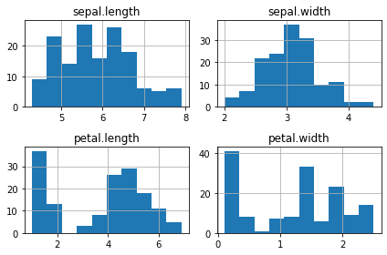
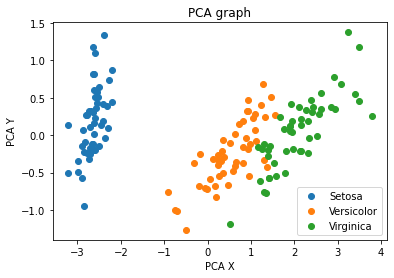

# Dimensionality Reduction

Dimensionality reduction serves as a potent technique for analysing and visualising data sets, especially when dealing with high-dimensional data such as datasets or outputs from machine learning models. These methods effectively reduce the number of features in your data, which is crucial considering that visualising anything beyond two dimensions is challenging. For this section we will focus on two commonly used methods for dimensionally reducing your data, One being Principal Component analysis (PCA) a linear method and second t-SNE a non-parametric/ non-linear method. 

# Examine the dataset
Lets make some plots looking at each of our features, so we can see the distribution of our features.
~~~
iris_df = pd.read_csv("iris.csv")

columns = list(iris_df.keys())
columns.remove("variety")

fig = plt.figure()

for i in range(0, len(columns)):
    ax=fig.add_subplot(2,2,i+1)
    iris_df[columns[i]].hist(ax=ax)
    ax.set_title(columns[i])
fig.tight_layout()  # Improves appearance a bit.
plt.show()
~~~
{: .language-python}

>
{: .output}

### Principle Component Analysis (PCA)

PCA is a technique that does rotations of data in a two dimensional array to decompose the array into combinations vectors that are orthogonal and can be ordered according to the amount of information they carry. As there are as many principal components as there are variables in the data, principal components are constructed in such a manner that the first principal component accounts for the largest possible variance in the data set. Hence, when you condense your data into two dimensions, you're essentially utilising the two principal components characterised by the highest variance.

~~~
# PCA
import pandas as pd
from sklearn.decomposition import PCA

iris_df = pd.read_csv("iris.csv")

subset_df = iris_df.iloc[:, :-1]
print(subset_df.shape)

pca = PCA(n_components=2).fit_transform(subset_df)

print(pca.shape)

~~~
{: .language-python}

>(150, 4)
>(150, 2)
{: .output}

Now lets visualise our reduced features:

~~~
import matplotlib.pyplot as plt

iris_df["pca_x"] = pca[:, 0]
iris_df["pca_y"] = pca[:, 0]

sp = iris_df.drop_duplicates(subset=['variety'])
sp = list(sp['variety'])
print(iris_df.head())
for opt in sp:
    subset_df = iris_df[iris_df['variety'] == opt ]
    plt.scatter(subset_df['pca_x'], subset_df['pca_y'], 
                label =opt)

plt.xlabel('PCA X')
plt.ylabel('PCA Y')
plt.title('PCA graph')
plt.legend()
#plt.close()
~~~
{: .language-python}

>
{: .output}

### t-distributed Stochastic Neighbor Embedding (t-SNE)
t-SNE is a statistical approach used to visually represent high-dimensional data by assigning each data point a position on a two- or three-dimensional map. Unlike linear techniques, t-SNE is nonlinear and is particularly effective for reducing the dimensionality of data to enable visualization in a lower-dimensional space. It accomplishes this by modeling each high-dimensional object as a point in two or three dimensions, ensuring that similar objects are positioned close together while dissimilar ones are placed farther apart with high probability.

~~~
# t-SNE embedding
import pandas as pd
from sklearn.manifold import TSNE

iris_df = pd.read_csv("iris.csv")

subset_df = iris_df.iloc[:, :-1]
print(subset_df.shape)

ts = TSNE(n_components=2).fit_transform(subset_df)

print(ts.shape)
~~~
{: .language-python}

>(150, 4)
>(150, 2)
{: .output}

~~~
import matplotlib.pyplot as plt

iris_df["tsne_x"] = ts[:, 0]
iris_df["tsne_y"] = ts[:, 0]

sp = iris_df.drop_duplicates(subset=['variety'])
sp = list(sp['variety'])
print(iris_df.head())
for opt in sp:
    subset_df = iris_df[iris_df['variety'] == opt ]
    plt.scatter(subset_df['tsne_x'], subset_df['tsne_y'], 
                label =opt)

plt.xlabel('tsne X')
plt.ylabel('tsne Y')
plt.title('TSNE graph')
plt.legend()
#plt.close()
~~~
{: .language-python}

>
{: .output}

> ## Exercise: Parameters
>
> Look up parameters that can be changed in PCA and t-SNE,
> and experiment with these. How do they change your resulting
> plots?  Might the choice of parameters lead you to make different
> conclusions about your data?
{: .challenge}

> ## Exercise: Other Algorithms
>
> There are other algorithms that can be used for doing dimensionality
> reduction, for example the Higher Order Singular Value Decomposition (HOSVD)
> Do an internet search for some of these and
> examine the example data that they are used on. Are there cases where they do 
> poorly? What level of care might you need to use before applying such methods
> for automation in critical scenarios?  What about for interactive data 
> exploration?
{: .challenge}



